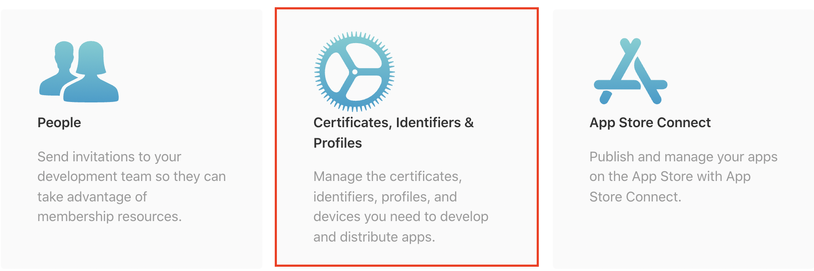
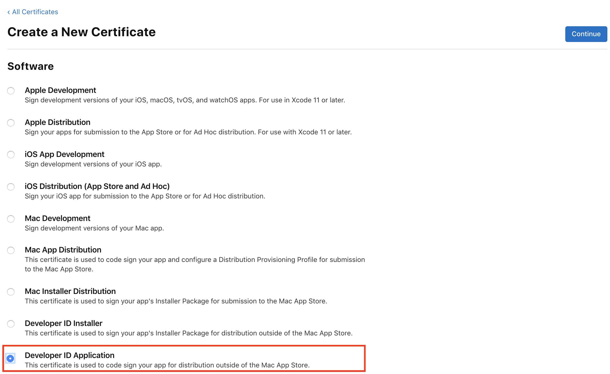
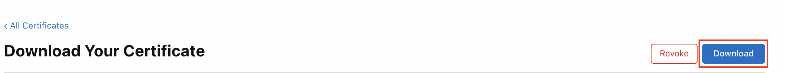
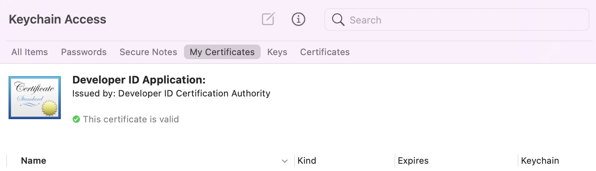

=====
macOS
=====

Overview
--------

In this tutorial, we'll learn how to generate a macOS code signing identity,
which is required to distribute your application across MacOS and iOS devices.

We will specifically focus on generating a `Developer ID Application identity
<https://developer.apple.com/developer-id/>`__, which is used to distribute a
*macOS application outside of the Mac App store*. However, the procedure for
creating all other types of identities is exactly the same. Once you familiarize
yourself with the general process, you'll be able to create identities required
to upload applications to the Mac or iOS App stores without much trouble.

Getting the code signing identity will require five main steps, which you will
be guided through in this tutorial:

1. Enrolling in the Apple Developer program

2. Generating a Certificate Signing Request on Keychain Access

3. Creating a Developer ID Application Certificate

4. Accessing the details of the Certificate on your Terminal

5. Anticipating potential issues with the identity in the future

Enrolling in the Apple Developer program
----------------------------------------

You can enrol in the Apple Developer program either as an individual, or as an
organization. In both cases, you'll have to follow the instructions on the
`Apple Developer website <https://developer.apple.com/programs/enroll/>`__.

Once you click "Start Enrollment Now" at the bottom of the page, you can either
sign in with your existing Apple ID or alternatively, create a new one:

.. image:: images/AppleID.png
   :width: 300

As part of the registration procedure, you'll have to pay a **$99 fee**, which
will be charged on an annual basis.

.. admonition:: Fee waivers

  If you're registering as a non-profit organization, an educational institution
  or a government entity, you may be eligible for a fee waiver, which you can
  read more about `here
  <https://developer.apple.com/support/membership-fee-waiver/>`__.

Generating a certificate request on Keychain Access
---------------------------------------------------

Now that you're set up with an Apple Developer ID, it's time to create a
*certificate request*, which you'll then use to generate a valid Developer ID
certificate.

First, open the Keychain Access application on your Mac. At the top left of your
screen, click ``Keychain Access`` > ``Certificate Assistant`` > ``Request a
Certificate From a Certificate Authority``:

.. image:: images/Keychain_request1.png
   :width: 500

A Certificate Assistant window should open up, looking similar to this one:

.. image:: images/Keychain_request2.png
   :width: 500

* In the field ``User Email Address``, type the email address associated with
  your Apple Developer Account (e.g. ``jane@example.com``).

* ``Common Name`` should refer to the name with which you registered to the
  Apple Developer program (e.g. ``Jane Doe``).

* The field ``CA Email Address`` can be left empty.

* Make sure that you choose ``Saved to Disk`` in the ``Request is`` field.

* Click "Continue", and save your Certificate Signing Request somewhere on your
  local machine. The saved certificate request should be of the format
  ``example.certSigningRequest``.

As documented by `Apple
<https://help.apple.com/xcode/mac/current/#/dev97211aeac>`__, this procedure
creates not only the file you have just saved, but also a private key in your
Keychain, which will establish the validity of your actual Developer ID
Application certificate later on.

Creating a Developer ID Application Certificate
-----------------------------------------------

Once you have saved the certificate request, head to the `Apple Developer
website <https://developer.apple.com/account>`__ and click "Certificates,
Identifiers and Profiles":

When you land in the Certificates section, click the "+" symbol to create a new
certificate:

.. image:: images/Create_certificate.png
   :width: 500

In the next page, you'll have to choose the type of certificate you want to
generate. In the Software section, choose the option of **"Developer ID
Application"**. **It's very important you choose the right type of
certificate**.

Later on, if you want to generate another code signing certificate for other
purposes, such as uploading your application the App store, you'll simply have
to choose a different type of a certificate on this page.

.. note::

   If you've been registered as an organization, there's a chance that
   the option to choose the Developer ID Application certificate is unavailable.
   This may happen if you're not assigned the role of the `Account Holder
   <https://developer.apple.com/documentation/security/notarizing_macos_software_before_distribution>`__.
   You can access and change these roles using `App Store Connect
   <https://appstoreconnect.apple.com/access/users>`__.

Select "Developer ID Application" and click "Continue". In the next window,
click "Choose file" and upload the Certificate Signing Request you have just
generated on your Keychain:

.. image:: images/Upload_certificate_request.png
   :width: 500

Once you click "Continue", Apple will generate your Developer ID Application
Certificate. Click the "Download" button and save the certificate on your local
machine:

The certificate should be of the format ``example.cer``. Once you download it,
double-click to install it in your Keychain Access.

If you now open your Keychain, selected the ``login`` keychain on
the left-hand side, and selec the ``My Certificates`` tab, you should see a
certificate with the title "Developer ID Application: <your name>".

Click on the certificate and make sure you see a note that reads ``This
certificate is valid``.

.. note::

   In this screenshot, the certificate details have been redacted. Your
   certificate should show expiration details, trust chains, and other
   details about you, the certificate issuer (Apple), and the certificate.

Congratulations! You've just successfully installed the Developer ID Application
certificate.

.. admonition:: Keep this certificate safe!

   The *specific type* of the certificate you have just created is quite
   precious, and you should make sure to keep it safe. A single Developer ID
   Application Certificate can be used to `sign, notarize and distribute
   multiple applications <https://developer.apple.com/forums/thread/657993>`__
   outside of the Mac App store, which is why a `very limited number of them
   <https://help.apple.com/xcode/mac/current/#/dev3a05256b8>`__ can be created
   on a particular Developer Account. You should consider making a backup copy,
   which will require you to export the certificate together with the associated
   private key from the Keychain. The procedure for doing so is `documented by
   Apple
   <https://support.apple.com/guide/keychain-access/import-and-export-keychain-items-kyca35961/mac>`__.

Next steps
----------

Now it's time to start using the Developer ID Application Certificate to sign,
notarize, and distribute your application!
