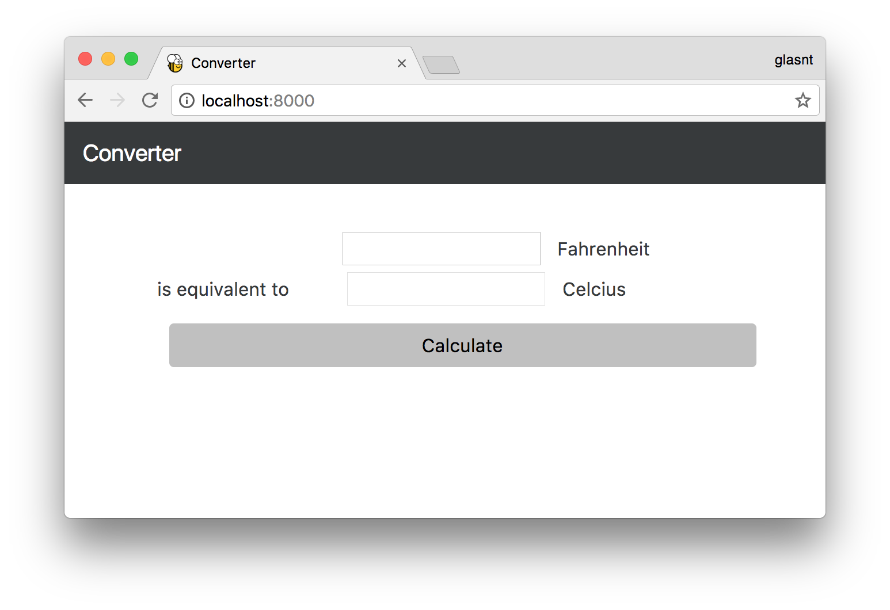

Tutorial 1 - Fahrenheit to Celcius
==================================

In this tutorial we will make your application do something interesting.

Add code to your project
------------------------

In this step we assume that you followed the :doc:`previous tutorial <tutorial-0>`.
Put the following code into ``helloworld\app.py``, replacing the old code:

.. code-block:: python

  import toga
  from toga.style import Pack
  from toga.style.pack import COLUMN, ROW, LEFT, RIGHT

  class Converter(toga.App):
      def calculate(self, widget):
          try:
              self.c_input.value = (float(self.f_input.value) - 32.0) * 5.0 / 9.0
          except Exception:
              self.c_input.value = '???'

      def startup(self):
          # Create a main window with a name matching the app
          self.main_window = toga.MainWindow(title=self.name)

          # Create a main content box
          f_box = toga.Box()
          c_box = toga.Box()
          box = toga.Box()

          self.c_input = toga.TextInput(readonly=True)
          self.f_input = toga.TextInput()

          self.c_label = toga.Label('Celcius', style=Pack(text_align=LEFT))
          self.f_label = toga.Label('Fahrenheit', style=Pack(text_align=LEFT))
          self.join_label = toga.Label('Is equivalent to', style=Pack(text_align=RIGHT))

          button = toga.Button('Calculate', on_press=self.calculate)

          f_box.add(self.f_input)
          f_box.add(self.f_label)

          c_box.add(self.join_label)
          c_box.add(self.c_input)
          c_box.add(self.c_label)

          box.add(f_box)
          box.add(c_box)
          box.add(button)

          box.style.update(direction=COLUMN, padding_top=10)
          f_box.style.update(direction=ROW, padding=5)
          c_box.style.update(direction=ROW, padding=5)

          self.c_input.style.update(flex=1)
          self.f_input.style.update(flex=1, padding_left=160)
          self.c_label.style.update(width=100, padding_left=10)
          self.f_label.style.update(width=100, padding_left=10)
          self.join_label.style.update(width=150, padding_right=10)

          button.style.update(padding=15, flex=1)

          # Add the content on the main window
          self.main_window.content = box

          # Show the main window
          self.main_window.show()

  def main():
      return Converter('Converter', 'org.pybee.converter')

Build and run the app
---------------------

Now you can invoke briefcase again:

.. code-block:: bash

  $ python setup.py ios -s

replacing ``ios`` with your platform of choice. You will be asked if you want
to replace the existing ``ios`` (or whatever platform you choose) directory; answer
``y``, and a new project will be generated and started.

You should see something that looks a bit like this:

.. image:: screenshots/tutorial-1-ios.png

Use the *same code*, but for the web
------------------------------------

Now, we're going to deploy the same code, but as a single page web
application. Make sure you have the Django dependencies installed (see
:doc:`/background/getting-started`), and run the following:

.. code-block:: bash

  $ python setup.py django -s

This will gather all the Javascript dependencies, create an initial database, start a Django runserver, and launch a browser. You should see the same application running in your browser:

.. note::

   If you get a "Server could not be contacted" error, it's possible your web browser
   started faster than the server; reload the page, and you should see the app.

