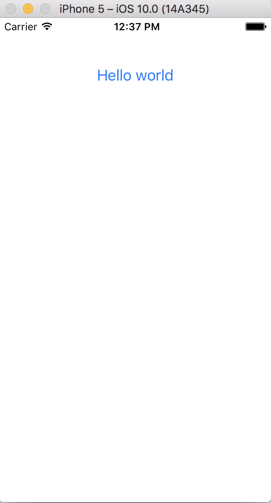

Tutorial 1- Toga Hello, World
=============================

In this tutorial you will create a simple ios application using toga framework.

Update your ios project
-----------------------

In this step we assume that you followed the :doc:`previous tutorial <tutorial-0>`. First at all, you can clean your previous app
in your ``iostutorial`` folder:

.. code-block:: bash

  rm -rf iOS/

We are going to use the Toga framework, so we have to include the
``toga-ios`` requirement in the ``ios`` section of ``setup.py`` script:

.. code-block:: python

  setup(name='HelloWorld',
      ...
      options = {
          ...
          'ios': {
              'app_requires': [
                  'toga-ios'
              ]
          }
      }
  )

And now you can update the application, using, for example, the Toga Hello World
found at <https://toga.readthedocs.io/en/latest/tutorial/tutorial-0.html>,
modified to be class-based:

.. code-block:: python

    import toga

    class HelloWorld(toga.App):

        def startup(self):
            self.main_window = toga.MainWindow(self.name)
            self.main_window.app = self

            box = toga.Box()

            button = toga.Button('Hello world', on_press=button_handler)
            button.style.set(margin=50)
            box.add(button)

            self.main_window.content = box
            self.main_window.show()

        def button_handler(widget):
            print("hello")

    def main():
        return HelloWorld('First App', 'org.pybee.helloworld')

Create the iOS app
------------------

Now you can invoke setuptools again:

.. code-block:: bash

  $ python setup.py ios

Notice that the ``app_packages`` is not empty after the update, and it contains toga packages and their requirements.

Open the iOS project with Xcode
-------------------------------

If you the ios project in Xcode you will see a Toga application:

If you click on the button, you should see messages appear in the console.
