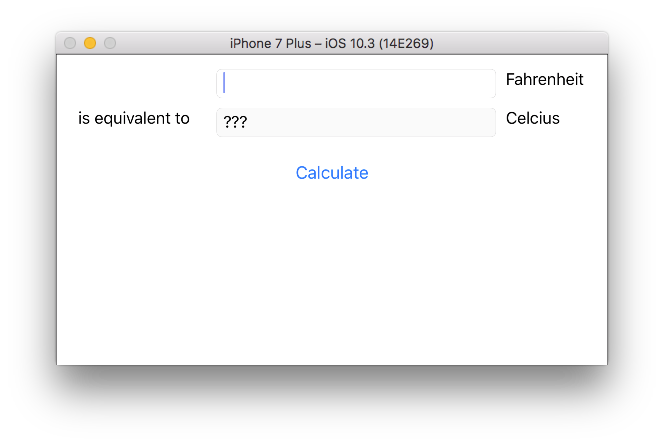

Tutorial 1- Toga Hello, World
=============================

In this tutorial you will create a simple application using toga framework.

Update your iOS project
-----------------------

In this step we assume that you followed the :doc:`previous tutorial <tutorial-0>`. First at all, you can clean your previous app
in your ``iostutorial`` folder:

.. code-block:: bash

  rm -rf iOS/

We are going to use the Toga framework, so we have to include the
``toga-ios`` requirement in the ``ios`` section of ``setup.py`` script:

.. code-block:: python

  setup(name='HelloWorld',
      ...
      options = {
          ...
          'ios': {
              'app_requires': [
                  'toga-ios'
              ]
          }
      }
  )

And now you can update the application.

We're going to use a version of the Toga Fahrenheit to Celsius converter tutorial found at <https://toga.readthedocs.io/en/latest/tutorial/tutorial-0.html>, modified to be class-based:

.. code-block:: python

  import toga

  class Converter(toga.App):
      def calculate(self, widget):
          try:
              self.c_input.value = (float(self.f_input.value) - 32.0) * 5.0 / 9.0
          except Exception:
              self.c_input.value = '???'

      def startup(self):
          self.main_window = toga.MainWindow(self.name)
          self.main_window.app = self

          # Tutorial 1
          c_box = toga.Box()
          f_box = toga.Box()
          box = toga.Box()

          self.c_input = toga.TextInput(readonly=True)
          self.f_input = toga.TextInput()

          c_label = toga.Label('Celcius', alignment=toga.LEFT_ALIGNED)
          f_label = toga.Label('Fahrenheit', alignment=toga.LEFT_ALIGNED)
          join_label = toga.Label('is equivalent to', alignment=toga.RIGHT_ALIGNED)

          button = toga.Button('Calculate', on_press=self.calculate)

          f_box.add(self.f_input)
          f_box.add(f_label)

          c_box.add(join_label)
          c_box.add(self.c_input)
          c_box.add(c_label)

          box.add(f_box)
          box.add(c_box)
          box.add(button)

          box.style.set(flex_direction='column', padding_top=10)
          f_box.style.set(flex_direction='row', margin=5)
          c_box.style.set(flex_direction='row', margin=5)

          self.c_input.style.set(flex=1)
          self.f_input.style.set(flex=1, margin_left=160)
          c_label.style.set(width=100, margin_left=10)
          f_label.style.set(width=100, margin_left=10)
          join_label.style.set(width=150, margin_right=10)
          button.style.set(margin=15)

          self.main_window.content = box
          self.main_window.show()

  def main():
      return Converter('Converter', 'org.pybee.converter')

Create the iOS app
------------------

Now you can invoke setuptools again:

.. code-block:: bash

  $ python setup.py ios

Notice that the ``app_packages`` is not empty after the update, and it contains toga packages and their requirements.

Open the iOS project with Xcode
-------------------------------

If you the ios project in Xcode you will see a Toga application:

If you click on the button, you should see messages appear in the console.

Use the *same code*, but for the web
------------------------------------

Edit the ``setup.py`` file to include a package helper for Django:

.. code-block:: python

  setup(name='HelloWorld',
      ...
      options = {
          ...
          'django': {
              'app_requires': [
                  'toga-django'
              ]
          }
      }
  )

Building Django has Javascript dependencies that are installed with NPM.
Pick the appropriate command to install NPM on your OS, or visit the `NPM website <https://www.npmjs.com/>`_ and follow the instructions.

.. code-block:: bash

  $ brew install npm  # OSX with Homebrew (https://brew.sh)
  $ apt-get install nodejs  # Ubuntu
  $ pacman -S npm  # Arch Linux

Now you can invoke setuptools again:

.. code-block:: bash

  $ python setup.py django

Once this process has completed, there are a couple of steps left (that are helpfully outputted by the last command) to setup the django project:

.. code-block:: bash

  $ cd django
  $ ./manage.py migrate
  
Then, we can run the application:

.. code-block:: bash

  $ ./manage.py runserver

If you open up ``localhost:8000`` in your browser, you should see the same application running in the web. 

.. image:: screenshots/tutorial-1-django.png

✨
